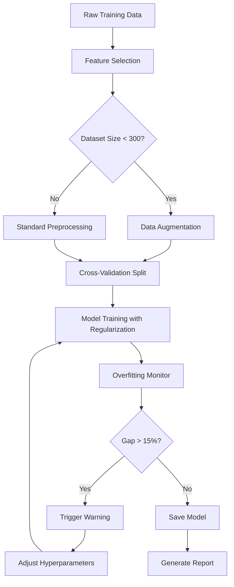

# Design Document

## Overview

This design addresses the critical overfitting issues observed in the current SMC trading model training pipeline. Analysis shows Random Forest models achieving 90-100% training accuracy but only 49-84% validation accuracy, and Neural Networks showing similar patterns with unstable learning curves. The solution implements a multi-layered anti-overfitting strategy that includes enhanced regularization, cross-validation, data augmentation, feature selection, and comprehensive monitoring.

The design integrates seamlessly with the existing model architecture (BaseSMCModel, RandomForestSMCModel, NeuralNetworkSMCModel) and training orchestrator (SMCModelTrainer) while maintaining backward compatibility.

## Architecture

### Component Structure

```
models/
├── base_model.py (Enhanced)
│   ├── BaseSMCModel (Modified)
│   │   ├── prepare_features() - Add feature selection
│   │   ├── evaluate() - Add overfitting metrics
│   │   └── cross_validate() - NEW
│   └── FeatureSelector - NEW
│
├── random_forest_model.py (Enhanced)
│   └── RandomForestSMCModel
│       └── train() - Add constrained hyperparameters
│
├── neural_network_model.py (Enhanced)
│   ├── MLPClassifier (Modified)
│   │   └── Add batch normalization layers
│   └── NeuralNetworkSMCModel
│       └── train() - Enhanced regularization
│
├── data_augmentation.py - NEW
│   ├── DataAugmenter
│   ├── add_gaussian_noise()
│   ├── apply_smote()
│   └── augment_small_datasets()
│
└── overfitting_monitor.py - NEW
    ├── OverfittingMonitor
    ├── calculate_metrics()
    ├── generate_learning_curves()
    └── create_report()

train_all_models.py (Enhanced)
└── SMCModelTrainer
    ├── train_with_cross_validation() - NEW
    └── generate_overfitting_report() - NEW
```


### Data Flow



## Components and Interfaces

### 1. FeatureSelector Class

**Purpose:** Reduce feature dimensionality to prevent fitting to noise

**Interface:**
```python
class FeatureSelector:
    def __init__(self, methods=['importance', 'correlation', 'mutual_info']):
        """Initialize with selection methods"""
        
    def fit(self, X: np.ndarray, y: np.ndarray, feature_names: List[str]) -> 'FeatureSelector':
        """Analyze features and determine which to keep"""
        
    def transform(self, X: np.ndarray) -> np.ndarray:
        """Apply feature selection"""
        
    def get_selected_features(self) -> List[str]:
        """Return list of selected feature names"""
        
    def get_feature_scores(self) -> pd.DataFrame:
        """Return importance scores for all features"""
```

**Implementation Details:**
- Uses Random Forest importance, mutual information, and correlation analysis
- Removes features below 25th percentile of importance
- Removes redundant features with correlation > 0.9
- Maintains at least 30 features to preserve information


### 2. DataAugmenter Class

**Purpose:** Generate synthetic training samples for small datasets

**Interface:**
```python
class DataAugmenter:
    def __init__(self, noise_std: float = 0.01, smote_k_neighbors: int = 5):
        """Initialize augmentation parameters"""
        
    def should_augment(self, n_samples: int, threshold: int = 300) -> bool:
        """Determine if augmentation is needed"""
        
    def augment(self, X: np.ndarray, y: np.ndarray) -> Tuple[np.ndarray, np.ndarray]:
        """Apply augmentation techniques"""
        
    def add_gaussian_noise(self, X: np.ndarray, std: float) -> np.ndarray:
        """Add controlled noise to features"""
        
    def apply_smote(self, X: np.ndarray, y: np.ndarray) -> Tuple[np.ndarray, np.ndarray]:
        """Balance classes using SMOTE"""
```

**Implementation Details:**
- Triggers when training samples < 300
- Adds Gaussian noise (std=0.01) to create variations
- Uses SMOTE for class balancing
- Validates augmented samples maintain realistic ranges
- Reports original vs augmented dataset sizes

### 3. OverfittingMonitor Class

**Purpose:** Track and report overfitting metrics during training

**Interface:**
```python
class OverfittingMonitor:
    def __init__(self, warning_threshold: float = 0.15):
        """Initialize with overfitting threshold"""
        
    def update(self, epoch: int, train_metrics: Dict, val_metrics: Dict):
        """Record metrics for an epoch"""
        
    def calculate_gap(self) -> float:
        """Calculate train-validation accuracy gap"""
        
    def is_overfitting(self) -> bool:
        """Check if overfitting threshold exceeded"""
        
    def generate_learning_curves(self, save_path: str):
        """Create visualization of train/val curves"""
        
    def get_summary(self) -> Dict:
        """Return overfitting summary statistics"""
```

**Implementation Details:**
- Tracks train/val accuracy and loss at each epoch
- Calculates gap = train_acc - val_acc
- Flags models with gap > 15%
- Generates matplotlib learning curves
- Saves metrics to structured JSON


### 4. Enhanced BaseSMCModel

**Modified Methods:**

```python
class BaseSMCModel:
    def prepare_features(self, df: pd.DataFrame, fit_scaler: bool = False,
                        apply_feature_selection: bool = True) -> Tuple[np.ndarray, np.ndarray]:
        """Enhanced with feature selection"""
        # Existing imputation and scaling
        # NEW: Apply feature selection if enabled
        if apply_feature_selection and fit_scaler:
            self.feature_selector = FeatureSelector()
            self.feature_selector.fit(X, y, self.feature_cols)
            X = self.feature_selector.transform(X)
        elif apply_feature_selection and hasattr(self, 'feature_selector'):
            X = self.feature_selector.transform(X)
        return X, y
    
    def cross_validate(self, X: np.ndarray, y: np.ndarray, 
                      n_folds: int = 5) -> Dict:
        """NEW: Perform k-fold cross-validation"""
        # Stratified k-fold split
        # Train on each fold
        # Return mean and std of metrics
        
    def evaluate(self, X: np.ndarray, y_true: np.ndarray, 
                dataset_name: str = 'Test') -> Dict:
        """Enhanced with overfitting metrics"""
        # Existing evaluation
        # NEW: Add train-val gap if training history available
        if hasattr(self, 'training_history'):
            metrics['train_val_gap'] = self._calculate_gap()
            metrics['overfitting_detected'] = metrics['train_val_gap'] > 0.15
        return metrics
```

### 5. Enhanced RandomForestSMCModel

**Modified train() method:**

```python
def train(self, X_train, y_train, X_val=None, y_val=None,
          n_estimators: int = 200,
          max_depth: int = 15,  # REDUCED from 20
          min_samples_split: int = 20,  # INCREASED from 10
          min_samples_leaf: int = 10,  # INCREASED from 5
          max_features: str = 'sqrt',  # More restrictive
          max_samples: float = 0.8,  # NEW: Bootstrap sampling limit
          **kwargs):
    """Train with anti-overfitting constraints"""
    
    # Data augmentation if needed
    if len(X_train) < 300:
        augmenter = DataAugmenter()
        X_train, y_train = augmenter.augment(X_train, y_train)
    
    # Train with constrained hyperparameters
    self.model = RandomForestClassifier(
        n_estimators=n_estimators,
        max_depth=max_depth,
        min_samples_split=min_samples_split,
        min_samples_leaf=min_samples_leaf,
        max_features=max_features,
        max_samples=max_samples,  # NEW
        class_weight='balanced',
        random_state=42
    )
    
    # Cross-validation
    cv_results = self.cross_validate(X_train, y_train, n_folds=5)
    
    # Final training
    self.model.fit(X_train, y_train)
    
    return history
```


### 6. Enhanced NeuralNetworkSMCModel

**Modified MLPClassifier architecture:**

```python
class MLPClassifier(nn.Module):
    def __init__(self, input_dim, hidden_dims, output_dim=3, dropout=0.4):
        super().__init__()
        layers = []
        prev_dim = input_dim
        
        for hidden_dim in hidden_dims:
            layers.append(nn.Linear(prev_dim, hidden_dim))
            layers.append(nn.BatchNorm1d(hidden_dim))  # NEW: Batch normalization
            layers.append(nn.ReLU())
            layers.append(nn.Dropout(dropout))
            prev_dim = hidden_dim
        
        layers.append(nn.Linear(prev_dim, output_dim))
        self.network = nn.Sequential(*layers)
```

**Modified train() method:**

```python
def train(self, X_train, y_train, X_val=None, y_val=None,
          hidden_dims=[256, 128, 64],  # REDUCED from [512, 256, 128, 64]
          dropout=0.5,  # INCREASED from 0.4
          learning_rate=0.005,  # REDUCED from 0.01
          batch_size=64,  # INCREASED from 32
          epochs=200,
          patience=20,  # INCREASED from 15
          weight_decay=0.1,  # INCREASED L2 regularization
          **kwargs):
    """Train with enhanced regularization"""
    
    # Data augmentation if needed
    if len(X_train) < 300:
        augmenter = DataAugmenter()
        X_train, y_train = augmenter.augment(X_train, y_train)
    
    # Initialize model with He initialization
    self.model = MLPClassifier(input_dim, hidden_dims, output_dim=3, dropout=dropout)
    self.model.apply(self._init_weights)
    
    # Loss with label smoothing
    criterion = nn.CrossEntropyLoss(label_smoothing=0.2)  # INCREASED
    
    # AdamW optimizer with weight decay
    optimizer = optim.AdamW(self.model.parameters(), 
                           lr=learning_rate, 
                           weight_decay=weight_decay)
    
    # ReduceLROnPlateau scheduler
    scheduler = optim.lr_scheduler.ReduceLROnPlateau(
        optimizer, mode='min', factor=0.5, patience=5, verbose=True
    )
    
    # Initialize overfitting monitor
    monitor = OverfittingMonitor(warning_threshold=0.15)
    
    # Training loop with monitoring
    for epoch in range(epochs):
        train_metrics = self._train_epoch(train_loader, criterion, optimizer)
        val_metrics = self._validate_epoch(val_loader, criterion)
        
        monitor.update(epoch, train_metrics, val_metrics)
        scheduler.step(val_metrics['loss'])
        
        # Early stopping based on validation loss
        if self._check_early_stopping(val_metrics['loss'], patience):
            break
    
    # Generate learning curves
    monitor.generate_learning_curves(f'models/trained/{self.symbol}_NN_curves.png')
    
    return history
```


### 7. Enhanced SMCModelTrainer

**New methods:**

```python
class SMCModelTrainer:
    def train_with_cross_validation(self, symbol: str, model_type: str) -> Dict:
        """Train model with cross-validation"""
        # Load data
        # Perform 5-fold stratified CV
        # Report mean and std of metrics
        # Train final model on full training set
        # Return comprehensive results
    
    def generate_overfitting_report(self, output_path: str):
        """Generate comprehensive overfitting analysis"""
        # Collect all training histories
        # Calculate gaps for each model
        # Identify problematic models
        # Create summary visualizations
        # Save detailed report
```

## Data Models

### FeatureSelectionResult

```python
@dataclass
class FeatureSelectionResult:
    selected_features: List[str]
    removed_features: List[str]
    feature_scores: Dict[str, float]
    selection_method: str
    n_original: int
    n_selected: int
```

### AugmentationResult

```python
@dataclass
class AugmentationResult:
    original_size: int
    augmented_size: int
    augmentation_methods: List[str]
    class_distribution_before: Dict[int, int]
    class_distribution_after: Dict[int, int]
```

### OverfittingMetrics

```python
@dataclass
class OverfittingMetrics:
    train_accuracy: float
    val_accuracy: float
    train_val_gap: float
    is_overfitting: bool
    early_stopped: bool
    best_epoch: int
    final_epoch: int
```

### CrossValidationResult

```python
@dataclass
class CrossValidationResult:
    mean_accuracy: float
    std_accuracy: float
    fold_accuracies: List[float]
    is_stable: bool  # std < 0.15
    n_folds: int
```


## Error Handling

### Feature Selection Errors

**Scenario:** Too few features remain after selection
- **Detection:** Check if n_selected < 30
- **Response:** Relax selection threshold to keep minimum 30 features
- **Logging:** Warn user about relaxed threshold

**Scenario:** All features highly correlated
- **Detection:** Correlation matrix analysis
- **Response:** Keep one feature from each correlation group
- **Logging:** Report correlation groups removed

### Data Augmentation Errors

**Scenario:** SMOTE fails due to insufficient samples per class
- **Detection:** Catch SMOTE ValueError
- **Response:** Fall back to Gaussian noise only
- **Logging:** Warn about SMOTE failure, report noise-only augmentation

**Scenario:** Augmented data creates unrealistic values
- **Detection:** Check for values outside training data range
- **Response:** Clip augmented values to [min, max] of original data
- **Logging:** Report clipping statistics

### Training Errors

**Scenario:** Validation loss becomes NaN
- **Detection:** Check for np.isnan(val_loss)
- **Response:** Reduce learning rate by 10x, restore last good checkpoint
- **Logging:** Log NaN detection and recovery attempt

**Scenario:** Early stopping triggers too early (< 20 epochs)
- **Detection:** Check epoch count at early stopping
- **Response:** Increase patience parameter, restart training
- **Logging:** Warn about premature stopping

### Cross-Validation Errors

**Scenario:** High variance across folds (std > 0.15)
- **Detection:** Calculate std of fold accuracies
- **Response:** Flag model as unstable, recommend more data or simpler model
- **Logging:** Report fold-wise results and instability warning

## Testing Strategy

### Unit Tests

**test_feature_selector.py**
- Test feature importance calculation
- Test correlation-based removal
- Test minimum feature threshold
- Test transform consistency

**test_data_augmenter.py**
- Test Gaussian noise addition
- Test SMOTE application
- Test augmentation threshold logic
- Test class balance preservation

**test_overfitting_monitor.py**
- Test gap calculation
- Test overfitting detection
- Test learning curve generation
- Test metric tracking

### Integration Tests

**test_enhanced_training.py**
- Test full training pipeline with feature selection
- Test training with data augmentation
- Test cross-validation integration
- Test overfitting monitoring during training

### Validation Tests

**test_model_performance.py**
- Compare baseline vs enhanced models on validation set
- Verify train-val gap reduction
- Verify test accuracy improvement or maintenance
- Verify cross-validation stability


### Performance Tests

**test_training_speed.py**
- Measure training time with vs without enhancements
- Verify cross-validation doesn't exceed 2x baseline time
- Verify feature selection completes in < 10 seconds

**test_memory_usage.py**
- Monitor memory during data augmentation
- Verify augmented datasets don't exceed 3x original size
- Check for memory leaks in training loop

## Configuration

### Default Hyperparameters

```python
# Random Forest Anti-Overfitting Config
RF_CONFIG = {
    'n_estimators': 200,
    'max_depth': 15,  # Reduced from 20
    'min_samples_split': 20,  # Increased from 10
    'min_samples_leaf': 10,  # Increased from 5
    'max_features': 'sqrt',
    'max_samples': 0.8,
    'class_weight': 'balanced'
}

# Neural Network Anti-Overfitting Config
NN_CONFIG = {
    'hidden_dims': [256, 128, 64],  # Reduced from [512, 256, 128, 64]
    'dropout': 0.5,  # Increased from 0.4
    'learning_rate': 0.005,  # Reduced from 0.01
    'batch_size': 64,  # Increased from 32
    'weight_decay': 0.1,  # Increased from 0.01
    'label_smoothing': 0.2,  # Increased from 0.15
    'patience': 20,  # Increased from 15
    'lr_scheduler_patience': 5,
    'lr_scheduler_factor': 0.5
}

# Feature Selection Config
FEATURE_SELECTION_CONFIG = {
    'methods': ['importance', 'correlation', 'mutual_info'],
    'importance_threshold_percentile': 25,
    'correlation_threshold': 0.9,
    'min_features': 30
}

# Data Augmentation Config
AUGMENTATION_CONFIG = {
    'threshold': 300,  # Augment if samples < 300
    'noise_std': 0.01,
    'smote_k_neighbors': 5,
    'max_augmentation_ratio': 2.0  # Don't exceed 2x original size
}

# Cross-Validation Config
CV_CONFIG = {
    'n_folds': 5,
    'stratified': True,
    'stability_threshold': 0.15  # Flag if std > 0.15
}

# Overfitting Monitor Config
MONITOR_CONFIG = {
    'warning_threshold': 0.15,  # Gap > 15% triggers warning
    'generate_curves': True,
    'save_metrics': True
}
```

## Migration Strategy

### Phase 1: Add New Components (Non-Breaking)
- Implement FeatureSelector, DataAugmenter, OverfittingMonitor as standalone classes
- Add unit tests for new components
- No changes to existing model code

### Phase 2: Enhance Base Model (Backward Compatible)
- Add optional parameters to BaseSMCModel methods
- Default behavior matches current implementation
- New features opt-in via parameters

### Phase 3: Update Model Implementations
- Modify RandomForestSMCModel with new default hyperparameters
- Enhance NeuralNetworkSMCModel with batch normalization
- Add cross-validation support
- Maintain backward compatibility through config flags

### Phase 4: Update Training Orchestrator
- Add overfitting reporting to SMCModelTrainer
- Integrate cross-validation workflow
- Generate enhanced training reports

### Phase 5: Validation and Rollout
- Run comparative tests: baseline vs enhanced
- Validate improvements on all symbols
- Update documentation
- Deploy to production training pipeline
