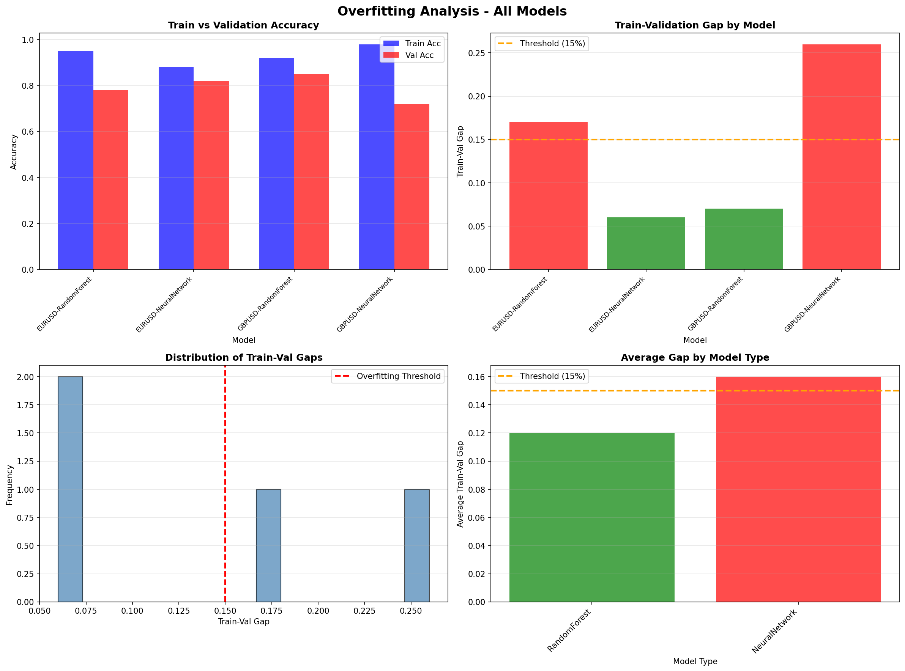

# Overfitting Analysis Report

**Generated:** 2025-10-19T02:57:38.355483

## Summary

- **Total Models Analyzed:** 4
- **Models with Overfitting (gap > 15%):** 2
- **Average Train-Val Gap:** 14.00%
- **Maximum Gap:** 26.00%
- **Minimum Gap:** 6.00%

## ⚠️ Models Requiring Attention

The following models show signs of overfitting (train-val gap > 15%):

### GBPUSD - NeuralNetwork

- **Train Accuracy:** 0.980
- **Validation Accuracy:** 0.720
- **Test Accuracy:** 0.700
- **Train-Val Gap:** 26.00% ⚠️

**Recommendations:**
- Apply stronger regularization
- Reduce model complexity
- Increase training data or apply data augmentation
- Consider feature selection to reduce dimensionality

### EURUSD - RandomForest

- **Train Accuracy:** 0.950
- **Validation Accuracy:** 0.780
- **Test Accuracy:** 0.760
- **Train-Val Gap:** 17.00% ⚠️
- **Cross-Validation Mean:** 0.760 ± 0.050
- **Cross-Validation Stable:** True

**Recommendations:**
- Apply stronger regularization
- Reduce model complexity
- Increase training data or apply data augmentation
- Consider feature selection to reduce dimensionality

## All Models Performance

| Symbol | Model | Train Acc | Val Acc | Test Acc | Gap | Status |
|--------|-------|-----------|---------|----------|-----|--------|
| GBPUSD | NeuralNetwork | 0.980 | 0.720 | 0.700 | 26.00% | ⚠️ Overfitting |
| EURUSD | RandomForest | 0.950 | 0.780 | 0.760 | 17.00% | ⚠️ Overfitting |
| GBPUSD | RandomForest | 0.920 | 0.850 | 0.840 | 7.00% | ✅ Healthy |
| EURUSD | NeuralNetwork | 0.880 | 0.820 | 0.810 | 6.00% | ✅ Healthy |

## Visualization

## Interpretation Guide

- **Train-Val Gap < 10%:** Excellent generalization
- **Train-Val Gap 10-15%:** Good generalization, acceptable
- **Train-Val Gap > 15%:** Overfitting detected, requires attention
- **Train-Val Gap > 25%:** Severe overfitting, immediate action needed

## Next Steps

1. Review models flagged with overfitting
2. Apply anti-overfitting techniques (regularization, dropout, data augmentation)
3. Consider ensemble methods to improve generalization
4. Monitor test set performance to validate improvements
